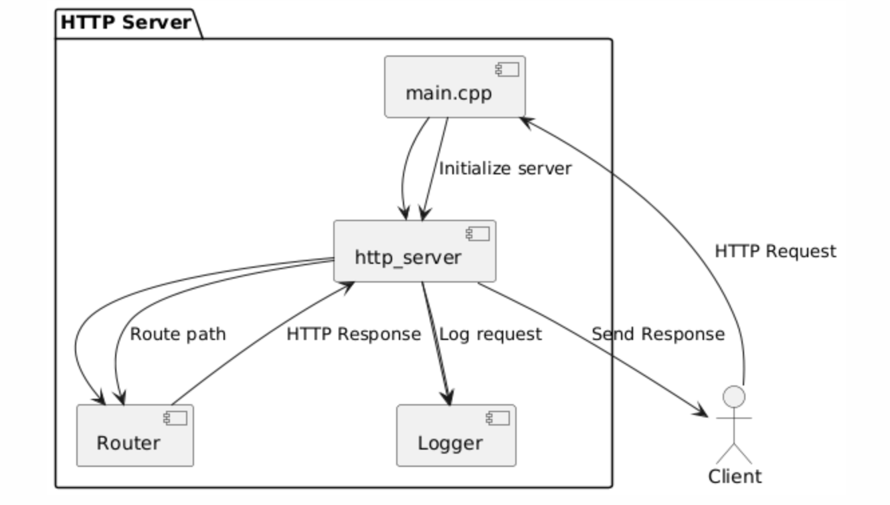
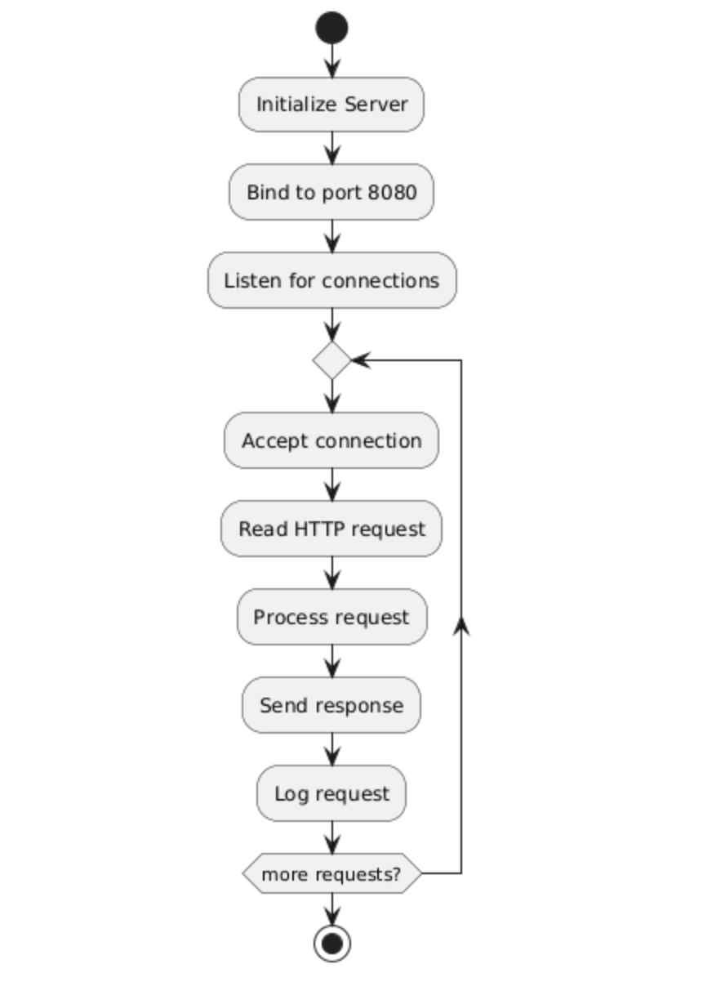
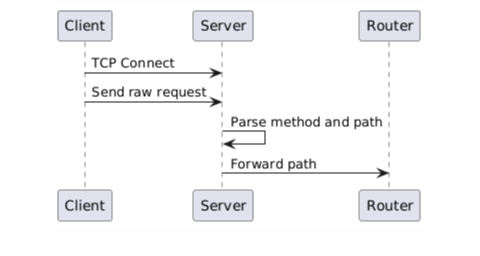
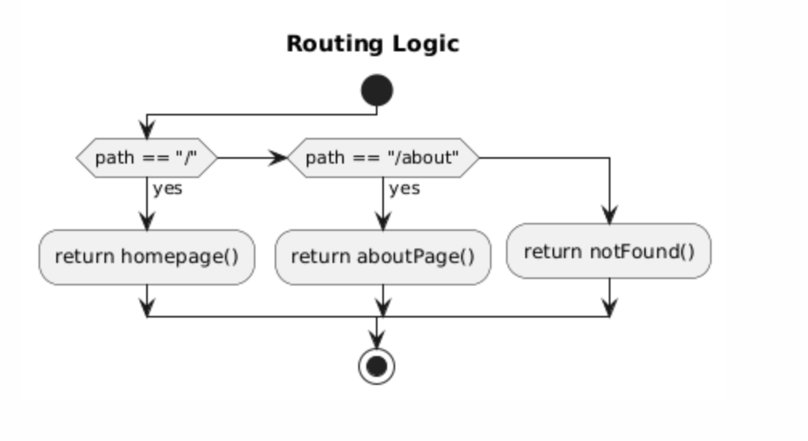
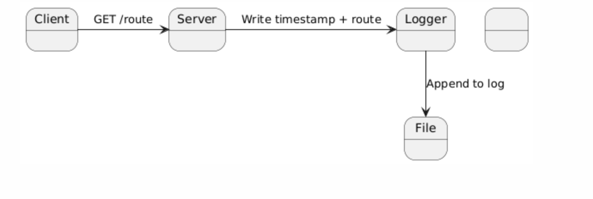

Building an HTTP Server from Scratch in C++
===========================================

Most of us start our web journey with frameworks like Flask, Express, or Spring Boot. But at some point, a question hits you: what if I had to build all this from scratch? No abstractions. No libraries. Just sockets and raw C++. That's exactly what I set out to do.

---

Why Build It?
-------------

I wanted to know what really happens when you open a browser and type in a URL. The goal was to learn:

- How a server listens for connections
- How it reads raw HTTP requests
- How it routes those requests
- How it sends back HTTP responses
- And how it logs everything along the way

This is one of those projects where the "hard way" is the best teacher.

---

System Overview
---------------

Here's a high-level overview of the components involved:




The path `/app/public/blog/http-server-in-cpp/image1` is an absolute path relative to your project root.  
You do **not** need to keep the image in the same directory as your markdown file, but the path must be correct relative to where your static file server expects to find images.  
If your static site generator or server serves `/public` as the web root, this path will work.  
Otherwise, adjust the path to match your server's configuration or use a relative path if needed (e.g., `../public/blog/http-server-in-cpp/image1`).

---

Step-by-Step Breakdown
-----------------------

### 1. Startup

In `main.cpp`, we instantiate the server and start listening:

```cpp
int main() {
    HttpServer server(8080);
    server.start();
    return 0;
}
```



---

### 2. Request Parsing

Inside `http_server.cpp`, after accepting a connection:

```cpp
char buffer[4096];
int bytesReceived = recv(clientSocket, buffer, sizeof(buffer) - 1, 0);
std::string request(buffer);
std::istringstream stream(request);
std::string method, path;
stream >> method >> path;
```

We parse just the first line of the request to extract the HTTP method and the path.



---

### 3. Routing

Routing is handled in `router.cpp`. Here's a simplified example:

```cpp
std::string route(const std::string& path) {
    if (path == "/") return "HTTP/1.1 200 OK\r\n\r\nWelcome!";
    if (path == "/about") return "HTTP/1.1 200 OK\r\n\r\nAbout this server.";
    return "HTTP/1.1 404 Not Found\r\n\r\nPage not found.";
}
```



---

### 4. Response

Responses are simple strings — no fancy abstractions. Just plain HTTP:

```cpp
std::string response = "HTTP/1.1 200 OK\r\nContent-Type: text/plain\r\n\r\nHello from the server!";
send(clientSocket, response.c_str(), response.length(), 0);
```

That’s all it takes to send data back to the browser.

---

### 5. Logging

In `logger.cpp`, we log each request with a timestamp:

```cpp
std::ofstream log("server.log", std::ios::app);
log << "[" << currentTime() << "] " << method << " " << path << "\n";
```



---

What I Learned
--------------

- Socket programming gives you fine-grained control
- HTTP is simple but precise (every space and `\r\n` matters)
- Writing a router makes you appreciate Express
- Logs are essential for visibility

---

Limitations
-----------

- Only supports `GET`
- Single-threaded (one client at a time)
- No persistent connections
- No header parsing

---

Future Work
-----------

- Add threading
- Support POST and headers
- Serve static files (HTML, images)
- Add configuration options

---

Conclusion
----------

This project helped me demystify HTTP and web servers in general. Going low-level gives you insights that high-level frameworks hide. Highly recommended as a weekend project if you're into networks or systems programming.

Thanks for reading!