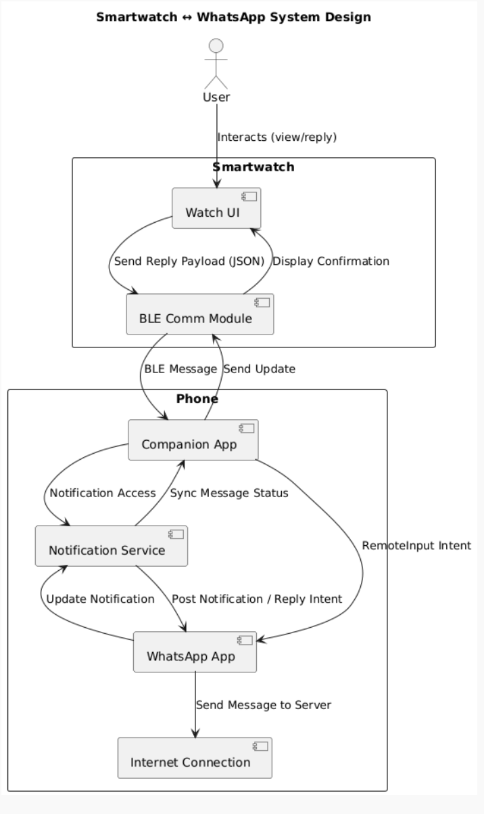

# How Your Smartwatch Replies to WhatsApp Without Internet

Ever sent a WhatsApp reply straight from your smartwatch and wondered, *wait… how’s this thing online?*  
No Wi-Fi. No SIM. Just that quiet Bluetooth tether to your phone — yet somehow, your message flies off into the ether.

It feels like magic. But it’s not.  
It’s a small, elegant distributed system hiding behind the simplest interface imaginable: a “Reply” button.

---

## The Illusion of Connectivity

At first glance, it seems like your watch must have some secret data channel. But in truth, it’s not really *talking* to WhatsApp at all.

Your **phone** is doing the real work.  
The watch is more like a remote terminal — a lightweight UI layer that sends commands and receives state updates. The trick is how these devices coordinate through layers of Bluetooth protocols, OS APIs, and app permissions without you ever noticing.

---

## The Players

### 1. The Phone — *The Brains*
This is where WhatsApp actually runs.  
It receives messages, maintains the Internet connection, and manages the Android or iOS notification system.

### 2. The Companion App — *The Translator*
Think of the Nothing X app, Galaxy Wearable, or Google’s Wear OS service.  
This app acts as a middleware — listening for WhatsApp notifications, serializing them, and sending them over Bluetooth to your watch.

### 3. The Watch — *The Interface*
All it really does is render the notification and collect your reply (voice, quick response, or text).  
When you hit “Send,” it doesn’t talk to WhatsApp directly — it just sends a tiny packet back to your phone.

---

## Message Flow: The Hidden Dance

1. WhatsApp posts a **notification** to Android’s system.
2. The companion app (with notification-listener permission) intercepts it.
3. It serializes the content — often a small JSON payload — and transmits it via **Bluetooth Low Energy (BLE)** to the watch.
4. The watch displays the notification.
5. You type or dictate a reply.
6. The reply is sent back to the phone through BLE.
7. The companion app rebuilds a **RemoteInput Intent** and hands it to WhatsApp.
8. WhatsApp sends your message over the Internet.

From your perspective: instant.  
From the system’s perspective: a seven-step relay across two devices, three APIs, and a link designed for heart-rate monitors.

---

## Bluetooth’s Quiet Brilliance

BLE wasn’t built for chat apps — it was built for *tiny, efficient* data transfers.  
Each packet is small (under a few hundred bytes), perfect for text.

Notifications and replies move through **GATT characteristics**, little “pipes” identified by UUIDs.  
The connection stays dormant most of the time, waking only to sync new data.  
That’s why your smartwatch battery can survive days while still chatting through WhatsApp.

On Wear OS, this can also use Google’s **MessageClient API**, a higher-level abstraction with retries, compression, and queueing — but conceptually, it’s still just passing messages over Bluetooth.

---

## Security and Trust

Can any app spoof messages on your behalf?  
Not quite.

Both Android and iOS enforce strict boundaries:

- The companion app must have explicit **notification access**.
- Replies only work via WhatsApp’s exposed **PendingIntent**, so the app still controls what can be sent.
- Bluetooth traffic is encrypted using **LE Secure Connections**, meaning your “brb” or “omw” isn’t flying through the air in plaintext.

The system is minimalist yet safe — just enough permissions, no unnecessary endpoints.

---

## Why This Design Works

Because it’s **simple**.

It reuses existing system primitives instead of inventing new ones:
- Notifications as the transport layer for context  
- BLE as the physical link  
- RemoteInput as the “reply” contract

This keeps power usage low, complexity minimal, and user privacy intact.  
If Bluetooth drops, the watch just queues the action — nothing breaks.

In a way, it’s distributed design done right:  
your phone as the logical core, your watch as a stateless peripheral.

---

## A Quick What-If

What if the watch *did* have its own Internet connection?

Technically, it could connect directly to WhatsApp servers. But then it would need:
- Authentication and key management  
- Message sync and state reconciliation  
- A persistent network service  

All that for one-line replies.  
Battery life would tank, and the UX would be brittle.  
So instead, engineers chose delegation — let the phone stay in charge.

That’s not a limitation. That’s elegance.

---

## Takeaway

Next time you flick your wrist and reply to a message mid-walk, know that a small, invisible orchestra of systems just played in sync:

- Android’s notification framework  
- BLE protocol stacks  
- Companion app daemons  
- WhatsApp’s RemoteInput APIs  

All collaborating for a single short text.

We think of it as convenience tech.  
But really, it’s a quiet triumph of thoughtful, distributed design — hiding in plain sight, buzzing softly on your wrist.

---

## UML System Design Diagram (PlantUML)

Written by an engineer who got curious about how everyday systems quietly cooperate under the hood.

## The Real Magic

The smartwatch-WhatsApp dance isn't impressive because it's complex — it's impressive because it's *not*.

Good distributed systems don't announce themselves. They don't demand new protocols or reinvent wheels. They take existing pieces — notifications, Bluetooth, intents — and compose them so elegantly that the seams disappear.

Your watch doesn't need to understand WhatsApp. WhatsApp doesn't need to know about your watch. The companion app speaks both languages, and suddenly two isolated systems become one fluid experience.

That's the hallmark of thoughtful engineering: making the impossible feel inevitable.

Next time that gentle buzz interrupts your morning run, remember — you're not just replying to a text. You're witnessing decades of protocol design, API evolution, and careful abstraction working in perfect harmony.

*The best technology doesn't feel like technology at all.*
