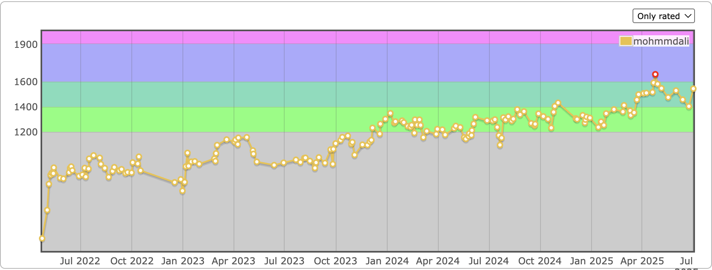

# From Lousy Beginnings to Expert Level — My Competitive Programming Journey

Competitive Programming (CP) has a way of humbling even the best of us.  
I still remember when one of my batchmates introduced me to it — full of excitement, sharing problems and contests like it was the coolest thing in the world.

I gave it a try… and to be honest, I wasn’t hooked.  
For the first one and a half years, I was pretty lousy about it — solving problems here and there, never too seriously.

---

## The Turning Point

Things changed around my **4th semester**.  
I realized I was still a newbie — and that hit my ego a bit. I didn’t like being mediocre at something I knew I could be good at.  
So I decided to go all in.

I started with **Antti Laaksonen’s Handbook**, which helped me get comfortable with the **C++ STL** and the **fundamentals of algorithms**.  
It was my first real taste of what CP demanded — structured thinking, patience, and persistence.

Then came **NeetCode.io** — I completed the entire _NeetCode 150_ problem set. That gave me the rhythm and consistency I needed.  
After that, I started diving deep into contests on **Codeforces**, **CodeChef**, **AtCoder**, and **LeetCode**.

---

## Trusting the Process

One of the hardest parts of CP isn’t learning syntax or algorithms — it’s _trusting the process_.  
There were so many days when I’d do great in practice but completely bomb in contests — silly mistakes, nervousness, bad decisions.  
It was frustrating.

But I kept telling myself:

> “There will be a day you’ll do it.”

And slowly, that day came — many times, in many forms.

---

## Building Momentum

At some point, things began to click.  
I started reading problems and catching myself saying, _“I think I can do this.”_  
I began breaking down problems more clearly, understanding patterns, and implementing with fewer errors.

Easy problems no longer scared me.  
That confidence — of reading a problem and _knowing_ I could solve it — changed everything.  
It wasn’t just skill improvement; it was mindset growth.

---

## How I Practiced

I had a pretty systematic way of practicing:

- On **Codeforces**, I’d sort problems by rating.  
  If I was solving _X_-rated problems comfortably, I’d move to _X + 200_.  
  If that felt too tough, I’d dial it down to _X + 100_.  
  It was like _binary searching my comfort zone_.

- On **LeetCode**, I solved problems by _topic_.  
  It’s great for structured learning — focusing on **DP**, **binary search**, **graph algorithms**, and so on.

- And of course, **CSES.fi** — an incredible problem set.  
  If you can solve the whole thing, you’re easily among the best in the world.

This mixture — structured topic learning, rating-based problem progression, and constant contest participation — shaped my learning curve.

---

## The Climb

Today, I’m proud to have reached:

- 🏅 **Expert on Codeforces (1658)**
- ⚡ **Guardian on LeetCode (2188, top 0.9%)**
- ⭐ **5★ on CodeChef**

It wasn’t instant, it wasn’t smooth — but it was worth it.

---

## Lessons That Stayed

The biggest lesson CP taught me is simple:

> “Rome wasn’t built in a day.”

Everyone has their own pace and path.  
What matters is _what you learn_ through the journey — the way you think, the discipline you build, and the persistence you develop.

I’ve always been quick at picking things up — like **chess**, where I reached the **99.7 percentile** in just a year because I played like crazy.  
But CP was different. It wasn’t something you could rush through.  
I had to _train my mind_ through deliberate, consistent hard work.

That early laziness taught me a lesson — I wasn’t bad, I just wasn’t putting in the work.  
Once I started doing that, everything changed.

---

## A Note to Beginners

If you’re just starting out, here’s my advice:

- **Learn, practice, and trust yourself.**
- Don’t compare your journey with others.  
  That person who seems “naturally good”? They might just be working 10x harder than you realize.
- **Hard work beats talent** — especially when talent doesn’t work hard.

Keep going.  
There will be bad contests, frustrating problems, and days when you question yourself.  
But someday, you’ll look back and smile — because every single bit of that grind will have been worth it.

---

## Conclusion

Written by someone who started out lost, learned to trust the process, and found joy in the climb.  
Competitive Programming didn’t just make me better at coding — it made me better at learning, thinking, and persevering.

Thanks for reading.
